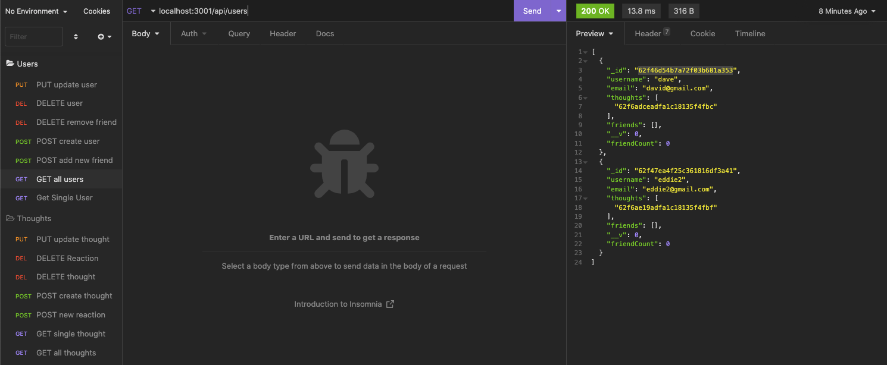
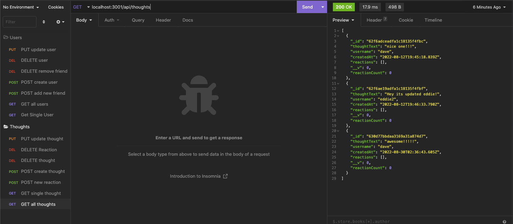

## noSQL-Social-Network-API

## Description
In this project we will be creating backend a social network api where we will use insomnia to create users and create "thoughts" (posts) for the users and be able to "react" or comment on other users posts. we also are able to update and delete both users and thoughts. An added feature of this application is that users are able to add each other as friends. friends can be displayed on the users friend count. 

## Technologies
* Javascript
* Node.js
* Express.js
* MongoDB
* Mongoose
* Insomnia

## Installation
first install all needed modules by typing in `npm install` in the terminal.

start the server by typing in `npm start` in the terminal.

## Usage
open insomnia and begin by using CRUD operations and utilizing the routes which will allow the user to:

- Create user
- Get all users
- Get a single user
- Update a user
- Delete a user
- Add a friend
- Delete a friend

as well as:

- Create a thought
- Get all thought
- Get a single thought
- Update a thought
- Delete a thought
- Add a reaction
- Delete a reaction

## Preview
[Demo Video](https://youtu.be/TTYHViAss-k)

## Author
- GitHub: davidpascual2
- Email: davidpascual200@gmail.com